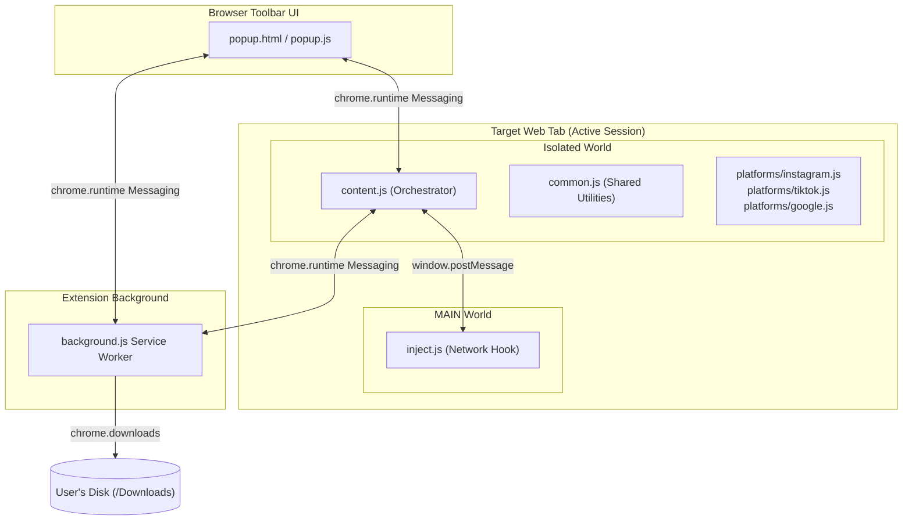

# Multiscraper — Full Documentation & Technical Reference Manual

> **Multiscraper** is a high-reliability, zero-dependency Chrome Extension (Manifest V3) for extracting profiles, posts, reviews, and media from **Instagram**, **TikTok**, and **Google Business** directly within the user's active, authenticated browser session.

---

## Table of Contents

1. [System Overview & Execution Model](#1-system-overview--execution-model)
2. [Installation & Browser Configuration](#2-installation--browser-configuration)
3. [User Guide & Platform Workflows](#3-user-guide--platform-workflows)
4. [Architecture & Component Design](#4-architecture--component-design)
5. [Complete API & Namespace Reference](#5-complete-api--namespace-reference)
6. [Chrome Message Bus & Interceptor Protocol](#6-chrome-message-bus--interceptor-protocol)
7. [Developer Manual & Adapter Guide](#7-developer-manual--adapter-guide)
8. [Testing & QA Framework](#8-testing--qa-framework)
9. [Security Audit & Compliance](#9-security-audit--compliance)
10. [Release History & Changelog](#10-release-history--changelog)

---

## 1. System Overview & Execution Model

### Why Multiscraper Works
Modern social platforms and business directories implement layered anti-scraping defenses:
- **Meta (Instagram)** blocks unauthenticated or sessionless external requests and heavily rate-limits public endpoints.
- **TikTok** cryptographically signs every API request using dynamic tokens (`X-Bogus`, `msToken`) generated by proprietary browser scripts.
- **Google** renders limited reviews in the Search knowledge panel DOM and protects its internal review RPCs (`GetLocalBoqProxy`) with CSRF tokens and session hashes.

Multiscraper runs **inside your active, logged-in browser tab**:
1. **First-Party Authentication**: Requests carry your active session cookies automatically.
2. **Native Signature Execution**: On TikTok, the extension drives page scrolling and intercepts responses signed by the platform's own runtime.
3. **Internal RPC Access**: On Google Business, the extension queries the same backend RPC that powers Google's review dialog, paginating through hundreds of reviews beyond the initial HTML panel.

---

## 2. Installation & Browser Configuration

### Step 1: Load Extension in Developer Mode
1. Open Google Chrome and go to `chrome://extensions`.
2. Turn **ON** the **Developer mode** toggle in the top-right corner.
3. Click **Load unpacked** and select the [`extension/`](file:///d:/dev/Multiscraper/extension/) folder.
4. Pin **Multiscraper** to your browser toolbar.

### Step 2: Configure Silent Batch Downloads
1. Open `chrome://settings/downloads`.
2. Set your default download location (e.g. `C:\Users\<user>\Downloads`).
3. **Turn OFF** "Ask where to save each file before downloading".
   > [!IMPORTANT]
   > Disabling this setting allows Chrome to save batches of images and videos silently into dedicated subfolders (`Downloads/multiscraper/<username>/`) without prompting for every single file.

---

## 3. User Guide & Platform Workflows

### 3.1 Scraping Instagram
1. Log in to `instagram.com` and open any profile (e.g. `https://www.instagram.com/username/`).
2. Click the Multiscraper icon. The popup detects the username.
3. Set **Max posts** (`0` = entire history, or a specific limit like `100`).
4. Click **Scrape profile**. On Instagram and TikTok the profile page is auto-scrolled and its own feed responses are harvested (1200–1800ms between scrolls); the tab must be showing the profile you are exporting.

### 3.2 Scraping TikTok
1. Log in to `tiktok.com` and open a creator's profile (`https://www.tiktok.com/@username`).
2. Click the Multiscraper icon and set the post limit.
3. Click **Scrape profile** and **keep the tab focused**. The extension auto-scrolls and captures signed API responses.

### 3.3 Scraping Google Business Places & Reviews
1. Open a Google Business place on `google.com` (via Google Search, a `share.google/...` shortlink, or Google Maps).
2. Click the Multiscraper icon.
3. Configure the review limit and click **Scrape profile**. The extension extracts business metadata (category, rating, hours, phone, address, website) and pages through user reviews.

### 3.4 Export Formats
- **Export JSON**: Complete structured data adhering to standard schemas.
- **Export CSV**: Standard spreadsheet-compatible CSV format.
- **Export Performance Stats (CSV)**: (Social platforms) Calculates total engagement, engagement rate vs video views, and averages.
- **Export Markdown Report**: (Google Business) Produces a formatted business audit document with rating breakdowns and review tables.

---

## 4. Architecture & Component Design



### Context Isolation Model
- **Popup UI**: Transient user interface managing input, progress bars, and export actions.
- **Isolated Content Script**: Sandboxed environment with DOM access. Handles scraping orchestration and in-page media blob conversions.
- **MAIN World Interceptor**: Hooks native `fetch` and `XMLHttpRequest` to capture signed payloads.
- **Background Worker**: Manages `chrome.downloads`, dynamic `Referer` headers via `declarativeNetRequest`, and download retries.

---

## 5. Complete API & Namespace Reference

### 5.1 Shared Namespace (`window.MS`) — [`common.js`](file:///d:/dev/Multiscraper/extension/common.js)

```javascript
// Social media export schema keys
MS.SCHEMA_KEYS = [
  "id", "Post Author", "Post Author Full Name", "Post Author Image",
  "Post Author URL", "Post Author Is Verified", "Post Type", "Post Text",
  "Post Image", "Post Video", "Post Likes", "Post Comments Count",
  "Post Views", "Post Shares", "Post Saves", "Post URL", "Post Date",
  "Is Comments Disabled", "Post Accessibility Caption"
];

// Asynchronous sleep with Promise
MS.sleep = (ms) => new Promise((resolve) => setTimeout(resolve, ms));

// Ring buffer for intercepted network responses (max 100 entries)
MS.captureBuffer = [];
MS.flushBuffer = () => { MS.captureBuffer = []; };

// Injects MAIN-world interceptor once
MS.ensureInterceptor = function () { ... };

// Transforms post record to schema row
MS.toExportRow = function (post, keys) { ... };

// Serializes rows to RFC-4180 CSV
MS.toCSV = function (posts, keys) { ... };

// Flattens post carousel items into media manifest
MS.mediaManifest = function (result) { ... };
```

### 5.2 Google Business Adapter — [`platforms/google.js`](file:///d:/dev/Multiscraper/extension/platforms/google.js)

- **`findFid()`**: Locates the `0x...:0x...` Feature ID from `data-fid` attributes, Maps URLs, or HTML regex.
- **`cidUrl(fid)`**: Converts FID hex to BigInt decimal string for canonical Google Maps links.
- **`parseSubtitle()`**: Parses localized ratings, review counts, price ranges, and business categories across multiple languages.
- **`fetchReviewsRpc(fid, pageToken)`**: Queries `/_/SearchUi/data/batched/GetLocalBoqProxy` with nested array RPC parameters.
- **`markdownReport(business, reviews)`**: Compiles a publication-ready Markdown audit report.
- **`EXPORT_KEYS`**:
  ```javascript
  [
    "id", "Business Name", "Business Rating", "Business Review Count",
    "Business Category", "Business Price Range", "Business Address",
    "Business Phone", "Business Hours", "Business Website",
    "Business Google Maps URL", "Review Author", "Review Author URL",
    "Review Rating", "Review Date", "Review Date (relative)",
    "Review Text", "Review Text (translated)", "Review Language",
    "Review Likes", "Owner Reply", "Review Images"
  ]
  ```

---

## 6. Chrome Message Bus & Interceptor Protocol

### Extension Runtime Messages

| Message `type` | Direction | Payload | Description |
| --- | --- | --- | --- |
| `detect` | Popup → Content | `{ type: "detect" }` | Returns active tab platform and username. |
| `scrape` | Popup → Content | `{ type: "scrape", username, maxPosts }` | Launches scraping task. |
| `stop` | Popup → Content | `{ type: "stop" }` | Aborts active scrape loop. |
| `progress` | Content → Popup | `{ type: "progress", collected, total, profile }` | Real-time scrape progress counter. |
| `done` | Content → Popup | `{ type: "done", platform, profile, count }` | Signals scrape completion. |
| `downloadMedia` | Popup → Background | `{ type: "downloadMedia", files, folder, platform }` | Initiates background media downloads. |
| `mediaProgress` | Background → Popup | `{ type: "mediaProgress", done, ok, fail, total }` | Live disk write confirmation stats. |
| `tiktokDownload` | Popup → Content | `{ type: "tiktokDownload", files, folder }` | Executes session-authenticated TikTok video downloads. |
| `saveDownload` | Content → Background | `{ type: "saveDownload", url, filename }` | Writes converted blob Data URL to disk. |

---

## 7. Developer Manual & Adapter Guide

### Building a New Platform Adapter
1. Create `extension/platforms/newplatform.js` and implement `matches(host)`, `usernameFromUrl(url)`, and `scrape(opts, onProgress, shouldStop)`.
2. Register the adapter in `extension/content.js` inside `pickAdapter()`.
3. Add domain matches to `content_scripts` and `host_permissions` in `extension/manifest.json`.
4. Create an offline VM test in `tests/test-newplatform.js`.

---

## 8. Testing & QA Framework

Multiscraper features an offline unit testing framework using Node.js `vm` without external dependencies.

```bash
npm test
```

### Verified Test Suites
1. [`tests/test-normalizer.js`](file:///d:/dev/Multiscraper/tests/test-normalizer.js) — 24 assertions covering Instagram feed pagination, carousel flattening, and schema projections.
2. [`tests/test-download.js`](file:///d:/dev/Multiscraper/tests/test-download.js) — 10 assertions verifying background download queues, pre-resolution states, and error retries.
3. [`tests/test-google.js`](file:///d:/dev/Multiscraper/tests/test-google.js) — 17 assertions verifying Google Business RPC normalization, translations, owner reply isolation, and schema mapping.

---

## 9. Security Audit & Compliance

- **Manifest V3 Compliant**: Enforces strict CSP; zero remote code execution.
- **Least Privilege Permissions**: Scoped strictly to target platform domains and CDNs.
- **XSS Mitigations**: All dynamic UI values in `popup.js` are escaped with `escHtml()` or written via `.textContent`.
- **Path Traversal Protection**: Folder paths are sanitized in `background.js` (`sanitizeFolder`) and `content.js` (`sane`), stripping `..` and illegal characters.
- **Origin-Restricted Messaging**: `window.postMessage` in `inject.js` and `common.js` strictly validates `event.origin === window.location.origin`.
- **Zero Runtime Dependencies**: Eliminates supply chain risks.

---

## 10. Release History & Changelog

- **v0.3.0 (2026-08-15)**: Added Google Business listing and review scraping via `GetLocalBoqProxy` RPC, Markdown report generation, and `tests/test-google.js`.
- **v0.2.0 (2026-07-20)**: Added TikTok auto-scroll scraper, MAIN-world interceptor (`inject.js`), dynamic DNR `Referer` rule, and in-page video blob proxy.
- **v0.1.0 (2026-06-10)**: Initial release with Instagram direct REST pagination, background download manager, multi-format exports (JSON, CSV, Performance Stats), and offline VM test framework.
