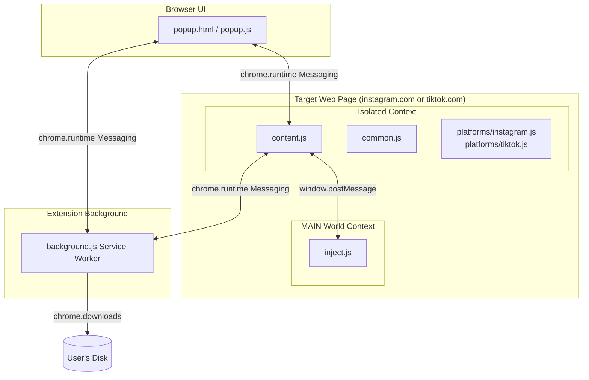
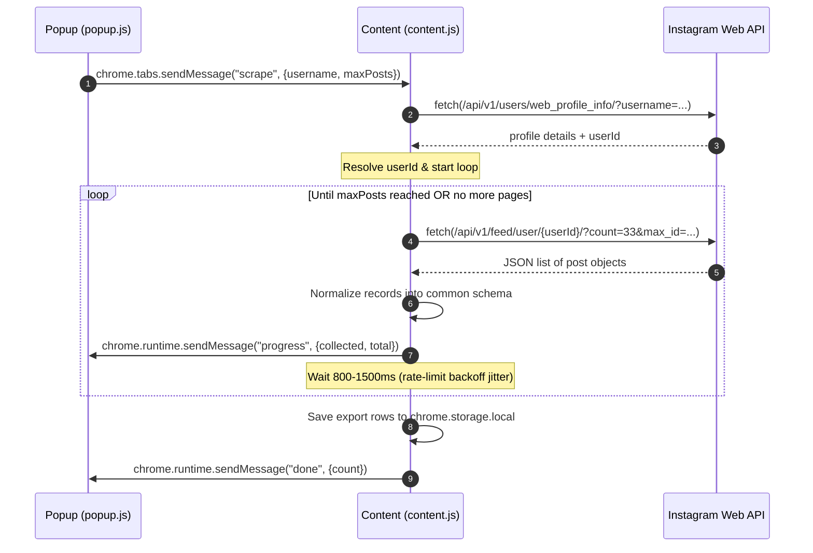
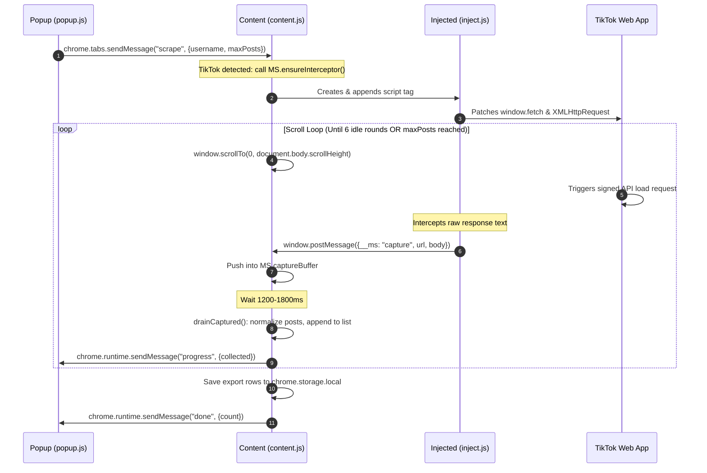
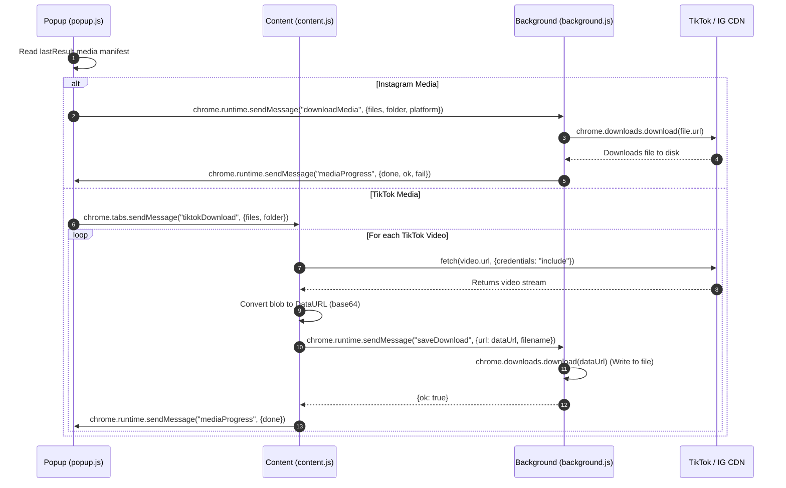

# Multiscraper Architecture & Component Design

This document details the architectural layout, execution contexts, runtime lifecycle, and messaging protocol of Multiscraper.

---

## 1. Context Isolation & Components

As a Chrome Manifest V3 extension, Multiscraper operates across three distinct execution environments. This isolation is crucial to bypass network restrictions while ensuring a responsive UI and safe background downloading.

### Execution Contexts

1. **Extension Popup UI Context** (`popup.html` / `popup.js`)
   - **Environment**: Runs inside the browser toolbar bubble. Closed when clicked away.
   - **Responsibilities**: Accepts user configurations (username, limit, subfolder), displays live progress bars, triggers CSV/JSON exports, and manages media download runs.
   - **Storage Access**: Reads and writes to `chrome.storage.local`.

2. **Content Script Isolated Context** (`common.js`, `platforms/*.js`, `content.js`)
   - **Environment**: Runs in a sandboxed, isolated JS world inside the active tab. It shares the DOM with the host page but has no access to the host page's javascript variables or functions.
   - **Responsibilities**: Detects URL states, runs the scraping loop (direct API requests or scroll-and-capture), normalizes raw JSON data, and handles TikTok video CORS-proxy blob fetching.
   - **Security Benefits**: Fetch requests carried out here automatically inherit the user's active session cookies (cookies are forwarded by Chrome as first-party requests).

3. **Page MAIN World Context** (`inject.js`)
   - **Environment**: Injected directly into the host page DOM via a `<script>` tag. It executes in the exact same scope as the site's own scripts.
   - **Responsibilities**: Intercepts requests by overriding `window.fetch` and `XMLHttpRequest.prototype.send`. Since TikTok signs all requests using anti-bot markers (`X-Bogus`/`msToken`), this interceptor lets TikTok's page do the signing, then copies the signed JSON response.

4. **Background Service Worker Context** (`background.js`)
   - **Environment**: Runs in the background on-demand. Persists across popup closures.
   - **Responsibilities**: Downloads media files sequentially using `chrome.downloads`. Updates dynamic routing rules via `chrome.declarativeNetRequest` to append `Referer: https://www.tiktok.com/` headers to TikTok CDN downloads (bypassing TikTok hotlinking protections).

---

## 2. Scraping Flow Diagrams

### Instagram Direct API Pagination
Instagram feeds are scraped using authenticated direct web API requests.

### TikTok Capture-and-Scroll Loop
TikTok feeds are intercepted since request parameters are cryptographically signed.

---

## 3. Media Download Pipeline

Downloading must bypass Content Security Policies (CSP) and hotlink checkers:
- **Instagram**: Popup contacts Background Script which calls `chrome.downloads`.
- **TikTok**: Videos require session cookies and origin headers. The content script fetches the video bytes inside the tab context, transforms the resulting binary blob into a JSON-serializable Data URL, and pipes it to the Background script to write to disk.

---

## 4. Message Passing Protocol

All internal extension communications use the following runtime message schema:

### 1. Internal Message Interfaces (Extension Bus)

| Sender | Receiver | Message Object (`msg`) | Response Style / Actions |
| --- | --- | --- | --- |
| **Popup** | **Content** | `{ type: "detect" }` | Returns `{ platform: "instagram"\|"tiktok"\|null, username: string\|null }` |
| **Popup** | **Content** | `{ type: "scrape", username: string, maxPosts: number }` | Starts the platform scrape. Returns `{ ok: true, count: number }` or `{ ok: false, error: string }`. Runs asynchronously. |
| **Popup** | **Content** | `{ type: "stop" }` | Triggers stop flag, breaking active scrape loop. Returns `{ ok: true }`. |
| **Content** | **Popup** | `{ type: "progress", collected: number, total: number\|null, profile: string }` | Updates popup scrape progress status bar. |
| **Content** | **Popup** | `{ type: "done", platform: string, profile: object, count: number }` | Informs popup that scrape is complete and results are stored. |
| **Content** | **Popup** | `{ type: "error", error: string }` | Informs popup that scrape failed, resetting controls. |
| **Popup** | **Background** | `{ type: "downloadMedia", files: Array, folder: string, platform: string }` | Starts background sequential download task. Background responds asynchronously. |
| **Background** | **Popup** | `{ type: "mediaProgress", done: number, ok: number, fail: number, total: number }` | Updates popup media progress stats. |
| **Popup** | **Content** | `{ type: "tiktokDownload", folder: string, files: Array }` | Informs content script to start TikTok in-tab CORS-bypass download loop. |
| **Content** | **Background** | `{ type: "saveDownload", url: string, filename: string }` | Asks background worker to write data URL payload to disk. Returns `{ ok: boolean, id?: number, error?: string }`. |

### 2. Main-Isolated World Bridge

| Sender | Receiver | Window Message Payload | Description |
| --- | --- | --- | --- |
| **Injected Script** (MAIN) | **Common JS** (Isolated) | `{ __ms: "capture", url: string, body: object }` | Sent via `window.postMessage` when a matched URL response is parsed by `inject.js`. |
