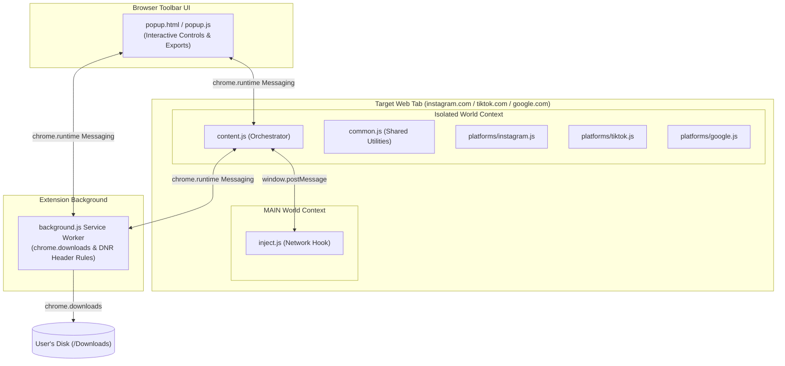
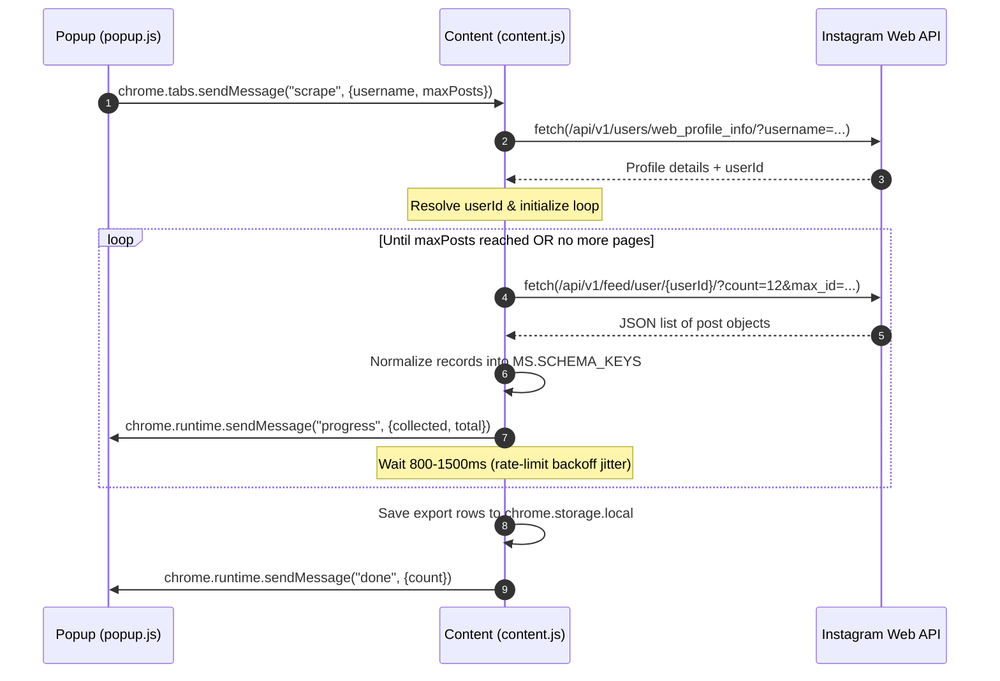
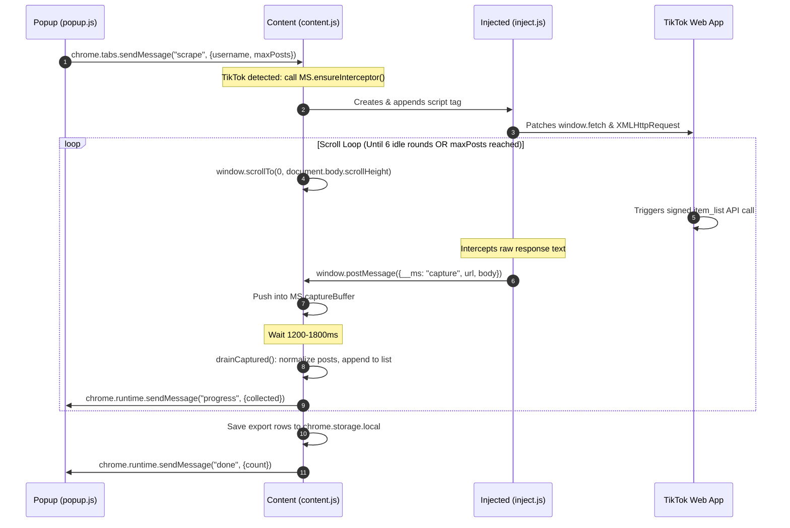
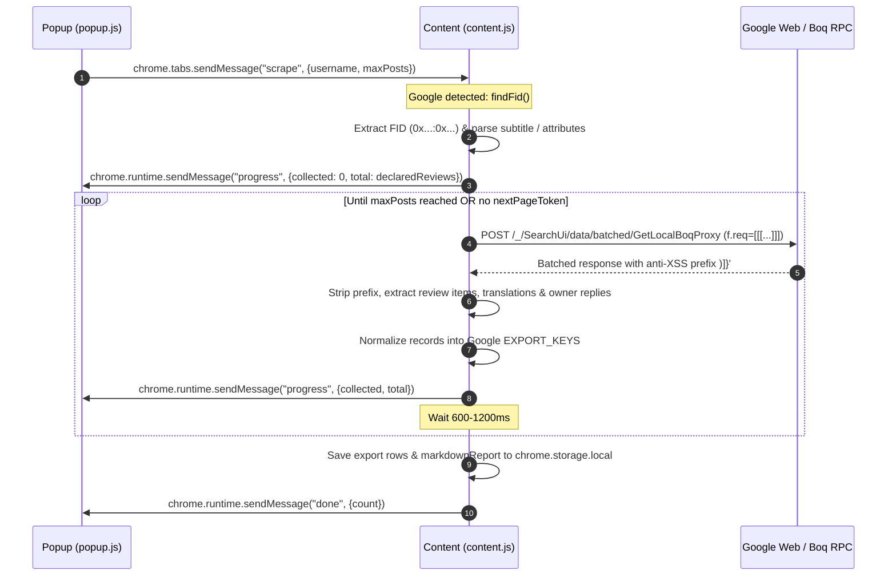
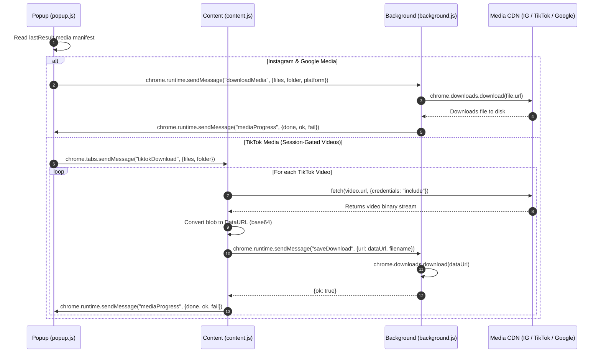

# Multiscraper Architecture & Component Design

This document details the architectural layout, execution contexts, runtime lifecycle, scraping strategies, and messaging protocols of Multiscraper.

---

## 1. Context Isolation & System Architecture

As a Chrome Manifest V3 extension, Multiscraper operates across three distinct execution environments. This isolation ensures security sandbox compliance while enabling first-party session reuse, DOM inspection, and uninterrupted background media downloading.

```mermaid
graph TD
    subgraph "Browser Toolbar UI"
        Popup["popup.html / popup.js<br>(Interactive Controls & Exports)"]
    end

    subgraph "Target Web Tab (instagram.com / tiktok.com / google.com)"
        subgraph "Isolated World Context"
            Content["content.js (Orchestrator)"]
            Common["common.js (Shared Utilities)"]
            IGAdapter["platforms/instagram.js"]
            TTAdapter["platforms/tiktok.js"]
            GoogleAdapter["platforms/google.js"]
        end
        subgraph "MAIN World Context"
            Inject["inject.js (Network Hook)"]
        end
    end

    subgraph "Extension Background"
        Worker["background.js Service Worker<br>(chrome.downloads & DNR Header Rules)"]
    end

    Popup <-->|chrome.runtime Messaging| Content
    Popup <-->|chrome.runtime Messaging| Worker
    Content <-->|window.postMessage| Inject
    Content <-->|chrome.runtime Messaging| Worker
    Worker -->|chrome.downloads| Disk[("User's Disk (/Downloads)")]
```

### Execution Context Responsibilities

1. **Extension Popup UI Context** ([`popup.html`](file:///d:/dev/Multiscraper/extension/popup.html) / [`popup.js`](file:///d:/dev/Multiscraper/extension/popup.js))
   - **Environment**: Transient browser action window.
   - **Responsibilities**: Detects active tab platform, captures user parameters (username, post limits, subfolder paths), renders live scraping and download progress bars, triggers CSV/JSON/Markdown exports, and handles one-click failed media retries.
   - **Storage Access**: Reads and writes to `chrome.storage.local`.

2. **Content Script Isolated Context** ([`common.js`](file:///d:/dev/Multiscraper/extension/common.js), [`platforms/*.js`](file:///d:/dev/Multiscraper/extension/platforms/), [`content.js`](file:///d:/dev/Multiscraper/extension/content.js))
   - **Environment**: Sandboxed JavaScript world with DOM access to the active tab, isolated from the page's global variables.
   - **Responsibilities**: Detects profile URLs, executes platform-specific extraction algorithms (REST pagination, scroll-interception, or RPC batching), normalizes raw data records, and handles in-page TikTok video blob downloads.
   - **Security Benefits**: All `fetch()` calls executed here automatically forward the user's active session cookies as first-party requests.

3. **Page MAIN World Context** ([`inject.js`](file:///d:/dev/Multiscraper/extension/inject.js))
   - **Environment**: Script injected directly into the DOM tree executing in the exact same scope as the host site.
   - **Responsibilities**: Overrides `window.fetch` and `XMLHttpRequest.prototype.send`. Intercepts responses from anti-bot cryptographically signed endpoints (`X-Bogus`/`msToken` on TikTok) and forwards parsed payloads to the isolated world via origin-restricted `window.postMessage`.

4. **Background Service Worker Context** ([`background.js`](file:///d:/dev/Multiscraper/extension/background.js))
   - **Environment**: Event-driven background worker that stays alive during active download tasks.
   - **Responsibilities**: Manages queueing and execution of `chrome.downloads`, applies path sanitization, tracks on-disk confirmation via `chrome.downloads.onChanged`, and dynamically registers/unregisters `Referer: https://www.tiktok.com/` rules via `chrome.declarativeNetRequest`.

---

## 2. Scraping Flow Diagrams

### A. Instagram Direct API Pagination
Instagram feeds are extracted using direct, authenticated web API requests with exponential backoff.

```mermaid
sequenceDiagram
    autonumber
    participant P as Popup (popup.js)
    participant C as Content (content.js)
    participant IG as Instagram Web API

    P->>C: chrome.tabs.sendMessage("scrape", {username, maxPosts})
    C->>IG: fetch(/api/v1/users/web_profile_info/?username=...)
    IG-->>C: Profile details + userId
    Note over C: Resolve userId & initialize loop

    loop Until maxPosts reached OR no more pages
        C->>IG: fetch(/api/v1/feed/user/{userId}/?count=12&max_id=...)
        IG-->>C: JSON list of post objects
        C->>C: Normalize records into MS.SCHEMA_KEYS
        C->>P: chrome.runtime.sendMessage("progress", {collected, total})
        Note over C: Wait 800-1500ms (rate-limit backoff jitter)
    end

    C->>C: Save export rows to chrome.storage.local
    C->>P: chrome.runtime.sendMessage("done", {count})
```

---

### B. TikTok Capture-and-Scroll Loop
TikTok feeds are intercepted from the page's own signed requests while auto-scrolling.

```mermaid
sequenceDiagram
    autonumber
    participant P as Popup (popup.js)
    participant C as Content (content.js)
    participant I as Injected (inject.js)
    participant TT as TikTok Web App

    P->>C: chrome.tabs.sendMessage("scrape", {username, maxPosts})
    Note over C: TikTok detected: call MS.ensureInterceptor()
    C->>I: Creates & appends script tag
    I->>TT: Patches window.fetch & XMLHttpRequest

    loop Scroll Loop (Until 6 idle rounds OR maxPosts reached)
        C->>C: window.scrollTo(0, document.body.scrollHeight)
        TT->>TT: Triggers signed item_list API call
        Note over I: Intercepts raw response text
        I->>C: window.postMessage({__ms: "capture", url, body})
        C->>C: Push into MS.captureBuffer
        Note over C: Wait 1200-1800ms
        C->>C: drainCaptured(): normalize posts, append to list
        C->>P: chrome.runtime.sendMessage("progress", {collected})
    end

    C->>C: Save export rows to chrome.storage.local
    C->>P: chrome.runtime.sendMessage("done", {count})
```

---

### C. Google Business Knowledge Panel & RPC Pagination
Google Business places (Google Search panels & Maps place pages) are extracted via DOM analysis and `GetLocalBoqProxy` RPC pagination.

```mermaid
sequenceDiagram
    autonumber
    participant P as Popup (popup.js)
    participant C as Content (content.js)
    participant G as Google Web / Boq RPC

    P->>C: chrome.tabs.sendMessage("scrape", {username, maxPosts})
    Note over C: Google detected: findFid()
    C->>C: Extract FID (0x...:0x...) & parse subtitle / attributes
    C->>P: chrome.runtime.sendMessage("progress", {collected: 0, total: declaredReviews})

    loop Until maxPosts reached OR no nextPageToken
        C->>G: POST /_/SearchUi/data/batched/GetLocalBoqProxy (f.req=[[[...]]])
        G-->>C: Batched response with anti-XSS prefix )]}'
        C->>C: Strip prefix, extract review items, translations & owner replies
        C->>C: Normalize records into Google EXPORT_KEYS
        C->>P: chrome.runtime.sendMessage("progress", {collected, total})
        Note over C: Wait 600-1200ms
    end

    C->>C: Save export rows & markdownReport to chrome.storage.local
    C->>P: chrome.runtime.sendMessage("done", {count})
```

---

## 3. Media Download Pipeline

Downloading media attachments must bypass Content Security Policies (CSP), referrer requirements, and session gates:

```mermaid
sequenceDiagram
    autonumber
    participant P as Popup (popup.js)
    participant C as Content (content.js)
    participant B as Background (background.js)
    participant CDN as Media CDN (IG / TikTok / Google)

    P->>P: Read lastResult.media manifest
    
    alt Instagram & Google Media
        P->>B: chrome.runtime.sendMessage("downloadMedia", {files, folder, platform})
        B->>CDN: chrome.downloads.download(file.url)
        CDN-->>B: Downloads file to disk
        B->>P: chrome.runtime.sendMessage("mediaProgress", {done, ok, fail})
    else TikTok Media (Session-Gated Videos)
        P->>C: chrome.tabs.sendMessage("tiktokDownload", {files, folder})
        loop For each TikTok Video
            C->>CDN: fetch(video.url, {credentials: "include"})
            CDN-->>C: Returns video binary stream
            C->>C: Convert blob to DataURL (base64)
            C->>B: chrome.runtime.sendMessage("saveDownload", {url: dataUrl, filename})
            B->>B: chrome.downloads.download(dataUrl)
            B-->>C: {ok: true}
            C->>P: chrome.runtime.sendMessage("mediaProgress", {done, ok, fail})
        end
    end
```

---

## 4. Message Passing Protocol

### Internal Extension Bus

| Sender | Receiver | Message Object (`msg`) | Response Style / Actions |
| --- | --- | --- | --- |
| **Popup** | **Content** | `{ type: "detect" }` | Returns `{ platform: "instagram"\|"tiktok"\|"google"\|null, username: string\|null }` |
| **Popup** | **Content** | `{ type: "scrape", username: string, maxPosts: number }` | Starts scraping. Returns `{ ok: true, count: number }` or `{ ok: false, error: string }`. Runs asynchronously. |
| **Popup** | **Content** | `{ type: "stop" }` | Sets stop flag to break the active loop. Returns `{ ok: true }`. |
| **Content** | **Popup** | `{ type: "progress", collected: number, total: number\|null, profile: string }` | Live updates for the popup progress bar and counter. |
| **Content** | **Popup** | `{ type: "done", platform: string, profile: object, count: number }` | Informs popup that scraping completed and results are saved in storage. |
| **Content** | **Popup** | `{ type: "error", error: string }` | Informs popup that scrape failed, resetting controls. |
| **Popup** | **Background** | `{ type: "downloadMedia", files: Array, folder: string, platform: string }` | Dispatches background batch download. |
| **Background** | **Popup** | `{ type: "mediaProgress", done: number, ok: number, fail: number, total: number }` | Reports confirmed disk write counts. |
| **Popup** | **Content** | `{ type: "tiktokDownload", folder: string, files: Array }` | Dispatches authenticated in-tab video fetching for TikTok. |
| **Content** | **Background** | `{ type: "saveDownload", url: string, filename: string }` | Calls background worker to save Data URL to disk. |

### MAIN-to-Isolated World Message Bridge

| Sender | Receiver | Window Message Payload | Description |
| --- | --- | --- | --- |
| **Injected Script** (MAIN) | **Common JS** (Isolated) | `{ __ms: "capture", url: string, body: object }` | Sent via `window.postMessage` when a matched network request is intercepted by [`inject.js`](file:///d:/dev/Multiscraper/extension/inject.js). |
